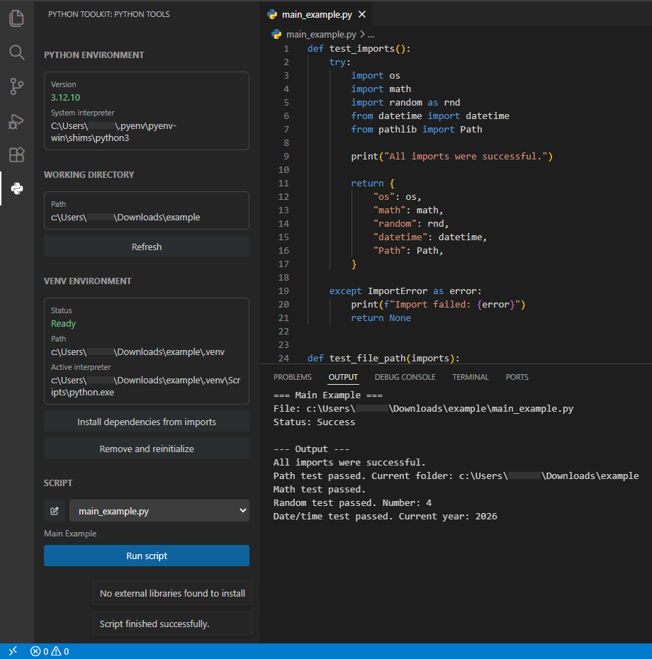

# Python Venv Toolkit

A simple VS Code extension for managing a Python virtual environment in the current workspace folder.



## Features

- automatic Python interpreter detection,
- automatic creation of a `.venv` environment in the workspace directory,
- ability to delete and reinitialize `.venv`,
- detection of imports in `.py` scripts and installation of missing libraries via `pip`,
- selection of a Python script from the side panel,
- running the selected script using the interpreter from `.venv`,
- script output in the Output channel: `Python Venv Toolkit`.

## Requirements

- VS Code 1.108.1 or newer,
- Python 3.x available in `PATH` or in a standard system location,
- npm.

## Installing Project Dependencies

```bash
npm install
```

## Running in Development Mode

```bash
npm run compile
```

Then, in VS Code, start extension debugging by pressing `F5`.

## Usage

1. Open a workspace folder in VS Code.
2. Open the `Python Venv` panel from the Activity Bar.
3. The extension will detect Python and create `.venv` in the opened folder.
4. Place or select any `.py` script in the workspace directory.
5. In the panel, select a script from the list and click `Run Script`.

Scripts are run with the working directory set to the opened VS Code folder. If the script imports external libraries, use the `Install dependencies from imports` button.

## Script Metadata

Optionally, you can add a script name and description in a comment or docstring:

```python
"""
SCRIPT_NAME: Daily report
SCRIPT_DESCRIPTION: Generates a report from data in the current folder.
"""

import pandas as pd

print("Start")
```

Older headers `RULE_NAME` and `RULE_DESCRIPTION` are also supported.

## Source Structure

```text
src/
├── extension.ts
├── MainViewProvider.ts
├── pythonDetector.ts
├── scriptRunner.ts
├── scriptValidator.ts
└── venvManager.ts
```

## Packaging the Extension

```bash
npm install
npm run package
npx @vscode/vsce package --no-dependencies
```

The resulting file will have a name like `python-venv-toolkit-0.1.0.vsix`.
